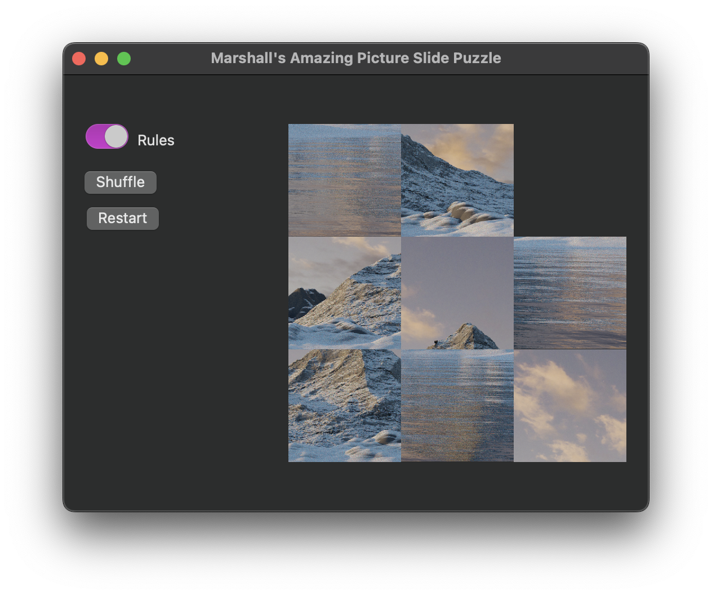
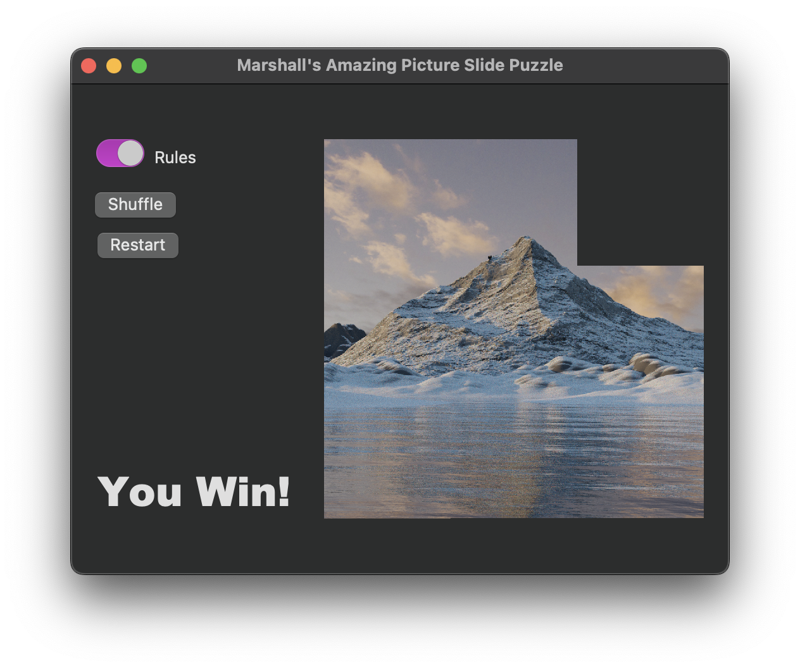
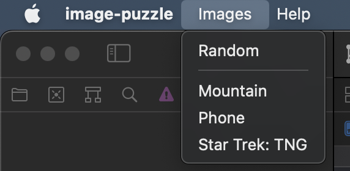
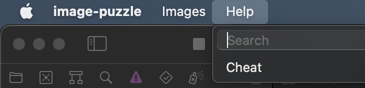

# Image Puzzle

This is a sliding image puzzle for my Application Development class final. The images were created by me in Blender and split into tiles in Photoshop.

## Features

* A few different images
* A random image selector
* Shuffle tiles
* Restart current game
* Option to disable game rules
* Cheat option to auto solve puzzle

## Screenshots

The beginning game screen.

An example of a completed game.

The list of image options and cheat button are located in the application menu.
